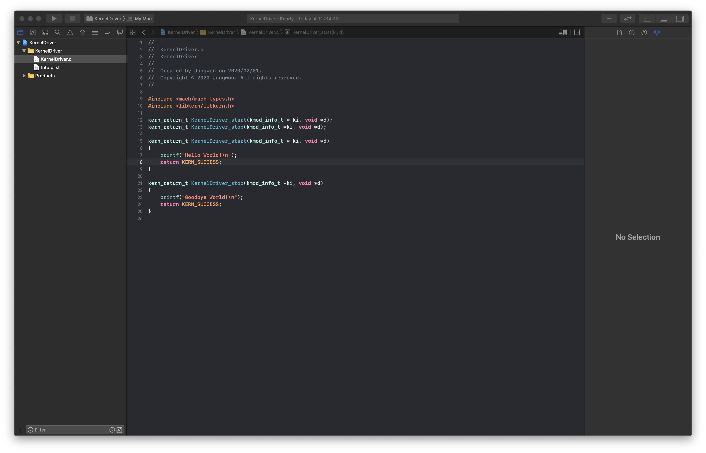
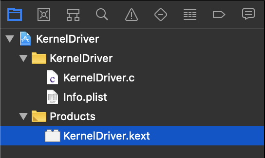

# OSX-Kext-Study

## 개요

"Hello World"를 출력하는 Driver를 만드는 방법에 대해 정리한 레포지토리입니다. 

XCode를 이용하여 OS X - Kernel Driver를 제작하고 직접 Load 하는 과정에 대해 설명합니다. 

즉, Kext 파일(Kernel Extension)을 통해 커널에서 "Hello World"가 출력되는 결과를 확인 할 수 있습니다. 

이런 확인 과정은 OS X를 모니터링하는 콘솔 앱이나 터미널의 "sudo dmesg" 명령어를 통해서 확인이 가능합니다. 

## 구현 방법

### < 프로젝트 세팅 >

XCode에서 새로운 프로젝트를 시작합니다.  

다음으로, macOS 탭의 Generic Kernel Extension 프로젝트를 선택합니다. 

### < 프로젝트 구성 >

프로젝트를 시작하면 위와 같은 구성으로 프로젝트가 시작 준비가 완료된 것을 확인 할 수 있습니다.  

### < 코드 작성 >

기존에 생성된 소스 파일에 코드를 추가로 입력합니다.

~~~C
#include <mach/mach_types.h>
#include <libkern/libkern.h> // 추가 코드

kern_return_t KernelDriver_start(kmod_info_t * ki, void *d);
kern_return_t KernelDriver_stop(kmod_info_t *ki, void *d);

kern_return_t KernelDriver_start(kmod_info_t * ki, void *d)
{
    printf("Hello World!\n"); // 추가 코드
    return KERN_SUCCESS;
}

kern_return_t KernelDriver_stop(kmod_info_t *ki, void *d)
{
    printf("Goodbye World!\n"); // 추가 코드
    return KERN_SUCCESS;
}
~~~

위의 코드를 통해 Kext에서 "Hello World!"와 "Goodbye World!"를 출력할 수 있습니다.

코드의 libkern은 애플에서 제공해주는 시스템 헤더파일이며, Kext에서 C / C++ 관련 라이브러리를 사용하고 싶은 경우에 include하여 사용하면 됩니다.

또한, KernelDriver_start(), KernelDriver_stop() 함수는 Kext 드라이버가 로드되어 시작(Start), 정지(Stop) 될 때 호출됩니다.

위의 코드를 통해 Kext가 로드(Load)되면서 "Hello World!"가 출력되고, Kext가 언로드(unLoad)되면서 "Goodbye World!"가 출력됩니다.

### < plist 수정 >

위에서 작성한 코드를 작동하기 위해서는 일부 프로젝트 설정이 필요합니다. 

plist의 경우는 프로젝트의 전반적인 설정, Property를 수정하고 결정하는 역할을 합니다. 

따라서, 위의 코드를 작동하기 위해서는 일부 Property를 추가해야 합니다. 

plist의 OSBundleLibraries 하위에 "com.apple.kpi.libkern"을 key로 입력하고 "16.7"을 value로 입력하면 됩니다. 

이는 애플에서 제공하는 libkern 라이브러리를 사용하기 위한 Property 설정이라고 생각하면 됩니다. 

OS X에서 C / C++ 관련 라이브러리를 사용하기 위해서는 애플에서 제공하는 libkern이라는 라이브러리를 이용해야 됩니다. 

### < 빌드 및 빌드 세팅 >

위에서와 같이 코딩을 완료했다면, 빌드를 하여 Kext 파일을 만들 수 있습니다.

XCode 프로젝트를 빌드하는 방법은 빌드 스키마를 수정하여 root 권한으로 빌드하는 방법과 디폴트 설정인 유저 권한으로 빌드하는 방법이 존재합니다.

__[ root 권한으로 빌드하는 방법 ]__

XCode 프로젝트의 빌드 버튼 오른쪽에 존재하는 스키마 버튼을 클릭하고, Edit Scheme 메뉴를 선택합니다.

Edit Scheme 메뉴에서 왼쪽 영역의 Run 메뉴를 선택합니다.

Run 메뉴의 Executable 메뉴을 드롭다운하여 "Ask on Launch"를 선택합니다.

다음으로 Debug Process As 영역을 root로 선택하면, root 권한으로 빌드가 가능합니다.

root 권한으로 XCode 프로젝트를 빌드하게 되면, Products 경로에 Kext 파일이 생성되는 것을 확인할 수 있습니다.

__[ user 권한으로 빌드하는 방법 ]__

XCode 프로젝트의 빌드 버튼을 통해 정상 빌드를 완료하면, user 권한으로 프로젝트가 빌드되게 됩니다.

user 권한으로 프로젝트를 빌드하게 되면, 생성된 Kext 파일에 대해서 root 권한 부여가 필요하게 됩니다.

XCode 프로젝트에서 정상적으로 빌드를 하게되면, Products 경로에 Kext 파일이 생성되게 됩니다.

생성된 Kext 파일의 위치를 파인더를 통해서 확인하고 싶다면, 생성된 Kext를 우클릭하여 "Show in Finder"를 선택하면 파인더에서 확인할 수 있습니다.

다음으로 Kext 파일이 생성된 경로까지 터미널을 통해서 이동합니다.

터미널을 통해서 해당 경로까지 이동했다면, 

~~~
ls -l
~~~

명령을 통해 생성된 Kext 파일의 권한을 확인할 수 있습니다.

터미널에서 

~~~
sudo chown -R root:wheel kext파일
sudo chmod -R 755 Kext파일
~~~

 명령을 통해 Kext 파일의 권한을 root로 변경 할 수 있습니다.

### < Kext Load 및 확인 >

현재 사용하고 있는 Mac 디바이스가 사용하고 있는 Kext를 확인 할 수 있습니다.

터미널에서

~~~
kextstat
~~~

명령을 입력하면, 사용하고 있는 Mac 디바이스가 사용하고 있는 Kext를 확인할 수 있습니다.

다음으로 XCode 프로젝트에서 생성한 Kext 파일을 Mac 디바이스에 로드(Load)하는 방법에 대해 알아 보겠습니다.

Kext를 로드하기 위해서는 해당 Mac 디바이스의 SIP가 비활성화 되어 있어야 합니다.

만약, Kext 파일을 빌드 했을 때, Code Signing이 되어 있다면 SIP 모드를 비활성화하지 않아도 되지만 Code Signing이 되어있지 않다면 SIP 모드를 비활성화해야 Kext 파일의 로드(Load)가 가능합니다.

[ SIP 모드를 확인하는 방법 ]

터미널에서 

~~~
csrutil status
~~~

명령을 통해서 SIP 활성화 여부를 확인할 수 있습니다.

System Integrity Protection status: enabled. : 현재 SIP 활성화 중

System Integrity Protection status: disabled. : 현재 SIP비활성화 중

__[ SIP 모드 비활성화 하는 방법]__

- 부팅 시 cmd + R를 눌러주어 복구 모드로 진입
- Utility > Terminal 열어서 아래 커맨드 입력

~~~
csrutil disable
~~~

SIP 모드를 비활성화 했다면, kext 로드(Load)가 가능합니다.

Kext 로드(Load)의 경우, 터미널에서 커맨드 입력을 통해 가능하게 됩니다.

~~~
sudo kextload kext파일명
~~~

__[ Kext Load 확인 방법 ]__

위의 방법을 통해서 정상적으로 Kext를 로드하였다면, Kext가 로드되면서 실행되는 kernel_start() 함수를 통해서 "Hello World!" 문구가 출력되는 것을 확인할 수 있습니다.

터미널에서 

~~~
sudo dmesg
~~~

명령을 입력하면 출력된 메시지를 확인할 수 있습니다.

Kext를 unLoad 하는 과정을 통해서 kernel_stop() 함수가 실행되고 "goodbye World" 문구가 출력되는 것을 확인할 수 있습니다.

"goodbye World" 문구도 동일하게 터미널에서 확인이 가능하지만, 이번에는 OS X에서 제공하는 콘솔 앱을 통해 확인해 보겠습니다.

 

LaunchPad에서 콘솔 앱을 실행합니다.

Kext를 unload 하기 전, 콘솔 앱에서 이전에 로드(Load)한 Kext 이름을 검색합니다.

다음으로, 터미널을 통해 kext를 unload 합니다.

~~~
sudo kextunload kext파일명
~~~

위의 명령을 통해서 kext를 unload 합니다.

 

Kext를 unload 하면, 콘솔 앱에서 "goodbye World!" 문구 출력 된 것을 확인할 수 있다.

 
